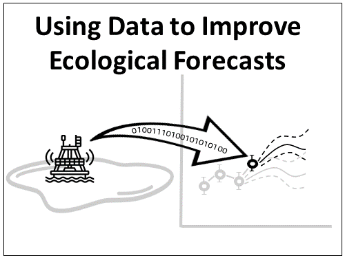

```{r setup, include=FALSE}
knitr::opts_chunk$set(echo = FALSE)
```
```{r}
time <- Sys.time()

# Add last update time
app_time <- format(file.info("ui.R")$mtime, "%Y-%m-%d")
app_update_txt <- paste0("This app was last updated on: ", app_time)

# Read in assessment questions
# Load and format questions
quest <- read.csv("data/student_questions.csv", row.names = 1)
# Number rows
ab1 <- 4:9
ab2 <- 13:16
ab3 <- 18:20
ab4 <- 23:24

l1 <- length(ab1)
l2 <- length(ab2)
l3 <- length(ab3)
l4 <- length(ab4)

# Number rows
row.names(quest) <- NULL
row.names(quest)[1:(ab1[1]-1)] <- paste0("q", 1:(ab1[1] -1))
row.names(quest)[ab1[1]:ab1[l1]] <- paste0("q", (ab1[1] -1), letters[1:l1])
row.names(quest)[(ab1[l1]+1):(ab2[1]-1)] <- paste0("q", ((ab1[l1]+1):(ab2[1] -1) - l1))
row.names(quest)[ab2[1]:ab2[l2]] <- paste0("q", (ab2[1]-1-l1), letters[1:l2])
row.names(quest)[(ab2[l2]+1):(ab3[1] -1)] <- paste0("q", (((ab2[l2]+1):(ab3[1] -1)) -(l1+l2)))
row.names(quest)[ab3[1]:ab3[l3]] <- paste0("q", (ab3[1]-1-l1-l2), letters[1:l3])
row.names(quest)[(ab3[l3]+1):(ab4[1] -1)] <- paste0("q", (((ab3[l3]+1):(ab4[1] -1)) -(l1+l2+l3)))
row.names(quest)[ab4[1]:ab4[l4]] <- paste0("q", (ab4[1]-1-l1-l2-l3), letters[1:l4])
row.names(quest)[(ab4[l4]+1):nrow(quest)] <- paste0("q", (((ab4[l4]+1):nrow(quest)) -(l1+l2+l3+l4)))


qid <- row.names(quest)
# Number location
# quest$location[1:(idx-1)] <- paste0(quest$location[1:(idx-1)], " - Q.", 1:(idx-1))
# # quest$location[idx:(idx2)] <- paste0(quest$location[idx:idx2],letters[1:length(idx:idx2)], ". ", )
# quest$location[(idx2+1):nrow(quest)] <- paste0(quest$location[(idx2+1):nrow(quest)], " - Q.", ((idx2+1):nrow(quest) - 6))

# answers <- params$answers
# answers[is.na(answers[, 1]), 1] <- ""

compare_da_plot_chk <- file.exists(params$da_method_plot)

# Read in tables
# tab_lr <- read.csv("data/out_tables/tab_lr.csv")
# tab_lr[is.na(tab_lr)] <- ""

# if(length(answers) == 1) {
#   answers <- quest
#   quest$location <- NULL
#   colnames(answers)[1] <- "Answer"
#   answers[, 1] <- ""
# }


# Load in text
module_text <- read.csv("data/module_text.csv", row.names = 1, header = FALSE)
tab_names <- read.csv("data/tab_names.csv", fileEncoding = "UTF-8-BOM")
rownames(tab_names) <- tab_names[, 1]

# Check for existence of files
pheno_chk <- !is.null(params$pheno_file)


```


***
### Name: `r params$name`  
### Student ID: `r params$id_number` 
#### Completed on: `r time`
***

# **Macrosystems EDDIE Module 7: Using Data to Improve Ecological Forecasts**


# Learning Objectives:

By the end of this module, you will be able to:

- `r module_text["LO1", ]`
- `r module_text["LO2", ]`
- `r module_text["LO3", ]`
- `r module_text["LO4", ]`
- `r module_text["LO5", ]`
\

```{r, echo=FALSE, fig.align="center", out.width="200px", fig.cap=""}

```


# Why macrosystems ecology and ecological forecasting?

**Macrosystems ecology** is the study of ecological dynamics at multiple interacting spatial and temporal scales (e.g., Heffernan et al. 2014). For example, _global_ climate change can interact with _local_ land-use activities to control how an ecosystem changes over the next decades. Macrosystems ecology recently emerged as a new sub-discipline of ecology to study ecosystems and ecological communities around the globe that are changing at an unprecedented rate because of human activities (IPCC 2013). The responses of ecosystems and communities are complex, non-linear, and driven by feedbacks across local, regional, and global scales (Heffernan et al. 2014). These characteristics necessitate novel approaches for making predictions about how systems may change to improve both our understanding of ecological phenomena as well as inform resource management.  


**Forecasting** is a tool that can be used for understanding and predicting macrosystems dynamics. To anticipate and prepare for increased variability in populations, communities, and ecosystems, there is a pressing need to know the future state of ecological systems across space and time (Dietze et al. 2018). Ecological forecasting is an emerging approach which provides an estimate of the future state of an ecological system with uncertainty, allowing society to prepare for changes in important ecosystem services. Ecological forecasts are a powerful test of the scientific method because ecologists make a hypothesis of how an ecological system works; embed their hypothesis in a model; use the model to make a forecast of future conditions; and then when observations become available, assess the accuracy of their forecast, which indicates if their hypothesis is supported or needs to be updated. Forecasts that are effectively communicated to the public and managers will be most useful for aiding decision-making. Consequently, macrosystems ecologists are increasingly using ecological forecasts to predict how ecosystems are changing over space and time (Dietze and Lynch 2019).  
\
In this module, students will generate an ecological forecast for a NEON site and explore how to use ecological data to improve forecast accuracy. This module will introduce students to the concept of data assimilation within an ecological forecast; how data assimilation can be used to improve forecast accuracy; how the level of uncertainty and temporal frequency of observations affects forecast output; and how data assimilation can affect decision-making using ecological forecasts.  \

## `r tab_names["mtab1", 2]`:

- Introduction to Ecological Forecasting: pre-readings and PowerPoint in class
- Activity A: Students build a model to simulate primary productivity for their chosen NEON site and generate a forecast.
- Activity B: Students generate multiple forecasts while assimilating data at different temporal frequencies and with different amounts of observation uncertainty.
- Activity C: Students then explore the effect of assimilating sensor data with different levels of observation uncertainty on forecast accuracy and make management decisions using an ecological forecast.
\

## Today's focal question: _How can we use data to improve ecological forecasts?_

We will address this question by building an ecological model to predict chlorophyll-a (a metric of algal biomass and primary productivity), generating ecological forecasts, and using data science approaches to integrate the most recently collected data into a forecast, a process known as data assimilation. Assimilating the most recent observations into a forecast model allows the forecaster to update the initial conditions, or the starting conditions, of the model, with the goal of improving forecast accuracy. For example, if our task is to generate a forecast of chlorophyll-a concentrations in a lake for tomorrow, it is likely that our forecast will be more accurate if we use today’s measurement of chlorophyll-a as the initial condition for our model, rather than last week’s measurement.

We will explore how assimilating different types of data (e.g., chlorophyll-a, nutrient concentrations, water temperature) at different temporal frequencies (e.g., daily, weekly) affects forecast output. Finally, we will assimilate different types of data into forecasts and examine how data assimilation affects water resource management decisions.

## R Shiny App:

The lesson content is hosted on an R Shiny App at [https://macrosystemseddie.shinyapps.io/module7/](https://macrosystemseddie.shinyapps.io/module7/)  
This can be accessed via any internet browser and allows you to navigate through the lesson via this app. You will fill in the questions below on this handout as you complete the lesson activities.

## Optional pre-class readings and video:

Webpages:

- [NOAA Ecological Forecasts](https://oceanservice.noaa.gov/ecoforecasting/noaa.html#:~:text=What%20is%20ecological%20forecasting%3F,%2C%20pollution%2C%20or%20habitat%20change.)
- [Ecological Forecasting Initiative](https://ecoforecast.org/about/)

Articles:

- Silver, N. (2012) Chapter 6: How to drown in three feet of water.Pages 176-203 inThe Signal and the Noise: Why so many Predictions Fail – but some Don't. Penguin Books.
- Dietze, M. and Lynch, H. 2019. Forecasting a bright future for ecology. _Frontiers in Ecology and the Environment_, _17_(1), 3. [https://doi.org/10.1002/fee.1994](https://doi.org/10.1002/fee.1994)
- Dietze, M.C., et al. 2018. Iterative near-term ecological forecasting: Needs, opportunities, and challenges. Proceedings of the National Academy of Sciences, 115(7), 1424–1432. [https://doi.org/10.1073/pnas.1710231115](https://doi.org/10.1073/pnas.1710231115)

Videos:

- NEON&#39;s [Ecological Forecast: The Science of Predicting Ecosystems](https://www.youtube.com/watch?v=Lgi_e7N-C8E&amp;t=196s&amp;pbjreload=101)
- Fundamentals of Ecological Forecasting Series: [Why Forecast?](https://www.youtube.com/watch?v=kq0DTcotpA0&amp;list=PLLWiknuNGd50Lc3rft4kFPc_oxAhiQ-6s&amp;index=1)
- Fundamentals of Ecological Forecasting Series: [Forecast Analysis Cycle](https://www.youtube.com/watch?v=zBsqjmdLYfk&list=PLLWiknuNGd50Lc3rft4kFPc_oxAhiQ-6s&index=1)
- Fundamentals of Ecological Forecasting Series: [Ensemble Kalman Filter](https://www.youtube.com/watch?v=UeFsEOGz_cc&list=PLLWiknuNGd50Lc3rft4kFPc_oxAhiQ-6s&index=1)

The questions you must answer are embedded in the Shiny interface. You can answer the questions there and generate a report at the end or you can fill out the questions within this document.

# Think about it!
\
Answer the following questions:

1. `r quest[qid[1], 1]`  
\
**Answer:** `r params$a1`\

2. `r quest[qid[2], 1]`   
\
**Answer:** `r params$a2`\


Now navigate to the [Shiny interface](https://macrosystemseddie.shinyapps.io/module7) to answer the rest of the questions.

# `r tab_names["mtab4", 2]`

## `r tab_names["stab1", 2]`\

***
`r module_text["obj_01", ]`

***

```{r results='asis', echo=FALSE}
if (!pheno_chk) {cat("<!---")}
```
  
*Figure 1. Phenocam image downloaded for `r quest[qid[4], 1]`.*
```{r results='asis', echo=FALSE}
if (!pheno_chk) {cat("-->")}
```
\

3. `r quest[qid[3], 1]`  
\

*Table 1. Site Characteristics*

| | |
| --- | --- |
| `r quest[qid[4], 1]` | `r params$a3a` |
| `r quest[qid[5], 1]` | `r params$a3b` |
| `r quest[qid[6], 1]` | `r params$a3c` |
| `r quest[qid[7], 1]` | `r params$a3d` |
| `r quest[qid[8], 1]` | `r params$a3e` |
| `r quest[qid[9], 1]` | `r params$a3f` |
\

## `r tab_names["stab2", 2]`\

***
`r module_text["obj_02", ]`

***

4. `r quest[qid[10], 1]`  

*Table 2. Description of site variable collection frequency:*  

| **Variable** | **Data collection frequency** | 
| --- | --- |  
| Air temperature | `r params$a4_at_freq` | 
| Surface water temperature | `r params$a4_wt_freq` | 
| Shortwave radiation | `r params$a4_swr_freq` | 
| Underwater PAR | `r params$a4_par_freq` | 
| Nitrogen | `r params$a4_n_freq` | 
| Chlorophyll-a | `r params$a4_chl_freq` | 

\

5. `r quest[qid[11], 1]`   
\
**Answer:** `r params$a5`\

## `r tab_names["stab3", 2]`\

***
`r module_text["obj_03", ]`

***

6. `r quest[qid[12], 1]`  
\

a. `r quest[qid[13], 1]`  
\
**Answer:** `r params$a6a`  
\

b. `r quest[qid[14], 1]`  
\
**Answer:** `r params$a6b`  
\

c. `r quest[qid[15], 1]`  
\
**Answer:** `r params$a6c`  
\

d. `r quest[qid[16], 1]`  
\
**Answer:** `r params$a6d`  
\

```{r}

```


# Activity A - Build a Model with Uncertainty

`r module_text["act_A", ]`

## `r tab_names["stab4", 2]`\

***
`r module_text["obj_04", ]`

***

7. `r quest[qid[17], 1]`  
\
a. `r quest[qid[18], 1]` 
\
**Answer:** `r params$a7a`  
\
b. `r quest[qid[19], 1]`  
\
**Answer:** `r params$a7b`  
\
c. `r quest[qid[20], 1]`  
\
**Answer:** `r params$a7c`  
\

8. `r quest[qid[21], 1]`  

*Table 3. Sorted model states and parameters:*  

| **State variables** | **Parameters** | 
| --- | --- |  
| `r params$a8_states` | `r params$a8_pars` | 

\

9. `r quest[qid[22], 1]`  
\
**Answer:** `r params$a9`  
\


*Table 4. Relationships between primary productivity and environmental variables:*  

| **Variable relationship** | **Q.6 Answers** | **Q.7 Answers** |   
| --- | --- | --- |  
| Primary productivity (chl-a) vs. water temperature | `r params$a6b` | `r params$a7a` |
| Primary productivity (chl-a) vs. light (underwater PAR) | `r params$a6c` | `r params$a7b` |
| Primary productivity (chl-a) vs. nutrients (nitrate sensor) | `r params$a6d` | `r params$a7c` |


\


## `r tab_names["stab5", 2]`\

***
`r module_text["obj_05", ]`

***

## `r tab_names["stab6", 2]`\

***
`r module_text["obj_06", ]`

***

10. `r quest[qid[25], 1]`  
\
**Answer:** `r params$a10`  
\

11. `r quest[qid[26], 1]`  
\
**Answer:** `r params$a11`  
\

12. `r quest[qid[27], 1]`  
\
**Answer:** `r params$a12`  
\

13. `r quest[qid[28], 1]`  
\
**Answer:** `r params$a13`  
\


# Activity B - Assimilate Data\

***
`r module_text["act_B", ]`

***

## `r tab_names["stab7", 2]`\

***
`r module_text["obj_07", ]`

***

14. `r quest[qid[29], 1]`  
\
**Answer:** `r params$a14`  
\

15. `r quest[qid[30], 1]`  
\
**Answer:** `r params$a15`  
\

16. `r quest[qid[31], 1]`  
\
**Answer:** `r params$a16`  
\

17. `r quest[qid[32], 1]`  
\
**Answer:** `r params$a17`  
\

18. `r quest[qid[33], 1]`  
\
**Answer:** `r params$a18`  
\

```{r results='asis', echo=FALSE}
if (!compare_da_plot_chk) {cat("<!---")}
```
  
*Figure 1: Comparison of forecast with and without data assimilation*   
```{r results='asis', echo=FALSE}
if (!compare_da_plot_chk) {cat("-->")}
```
\
*Table 5. Effect of data assimilation on forecast accuracy.*  

| **DA Method** | **Forecast RMSE** | 
| --- | --- |  
| No data assimilation | `r params$no_da_rmse` | 
| Chlorophyll-a data assimilation | `r params$chla_assim_rmse` | 
\
19. `r quest[qid[34], 1]`  
\
**Answer:** `r params$a19`  
\


## `r tab_names["stab8", 2]`\

***
`r module_text["obj_08", ]`

***

20. `r quest[qid[35], 1]`  
\
**Answer:** `r params$a20`  
\

21. `r quest[qid[36], 1]`  
\
**Answer:** `r params$a21`  
\
*Table 6. Effect of observation uncertainty on forecast accuracy.*  

| **Chl-a observation uncertainty** | **Forecast RMSE** | 
| --- | --- |  
| `r params$obs_uc_rmse[1,1]` | `r params$obs_uc_rmse[1,2]` | 
| `r params$obs_uc_rmse[2,1]` | `r params$obs_uc_rmse[2,2]` | 
| `r params$obs_uc_rmse[3,1]` | `r params$obs_uc_rmse[3,2]` | 
| `r params$obs_uc_rmse[4,1]` | `r params$obs_uc_rmse[4,2]` | 
| `r params$obs_uc_rmse[5,1]` | `r params$obs_uc_rmse[5,2]` | 
\
22. `r quest[qid[37], 1]`  
\
**Answer:** `r params$a22`  
\


## `r tab_names["stab9", 2]`\

***
`r module_text["obj_09", ]`

***

23. `r quest[qid[38], 1]`  
\
**Answer:** `r params$a23`  
\

24. `r quest[qid[39], 1]`  
\
**Answer:** `r params$a24`  
\
*Table 7. Effect of data assimilation frequency on forecast accuracy.*  

| **Chl-a observation uncertainty** | **Forecast RMSE** | 
| --- | --- |  
| `r params$da_freq_rmse[1,1]` | `r params$da_freq_rmse[1,2]` | 
| `r params$da_freq_rmse[2,1]` | `r params$da_freq_rmse[2,2]` | 
| `r params$da_freq_rmse[3,1]` | `r params$da_freq_rmse[3,2]` | 
| `r params$da_freq_rmse[4,1]` | `r params$da_freq_rmse[4,2]` | 
| `r params$da_freq_rmse[5,1]` | `r params$da_freq_rmse[5,2]` | 
\
25. `r quest[qid[40], 1]`  
\
**Answer:** `r params$a25`  
\

26. `r quest[qid[41], 1]`  
\
**Answer:** `r params$a26`  
\

27. `r quest[qid[42], 1]`  
\
**Answer:** `r params$a27`  
\

## `r tab_names["stab10", 2]`\

***
`r module_text["act_B_summ", ]`

***

28. `r quest[qid[43], 1]`  
\
**Answer:** `r params$a28`  
\

29. `r quest[qid[44], 1]`  
\
**Answer:** `r params$a29`  
\


# Activity C: Management Scenario\

`r module_text["act_C", ]`

## `r tab_names["stab11", 2]`\

***
`r module_text["obj_10", ]`

***

30. `r quest[qid[45], 1]`  
\
**Answer:** `r params$a30`  
\

**Note:** Questions 31-33 are not included in the final report as the order of these questions and their answers will vary depending on which sensor you have selected to purchase.\

34. `r quest[qid[49], 1]`  
\
**Answer:** `r params$a34`  
\

35. `r quest[qid[50], 1]`  
\
**Answer:** `r params$a35`  
\

36. `r quest[qid[51], 1]`  
\
**Answer:** `r params$a36`  
\

37. `r quest[qid[52], 1]`  
\
**Answer:** `r params$a37`  
\

## End of module - nice work!\

`r module_text["acknowledgement", ]`
`r app_update_txt`
